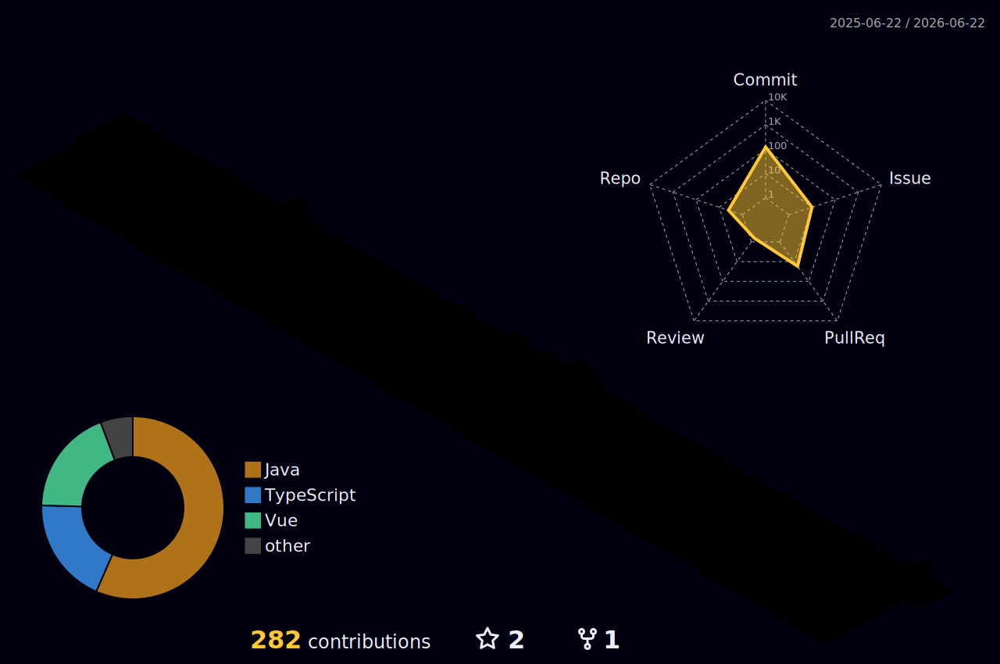

<a style="margin-left: auto; color: white; text-decoration: none; background-color: gray; border-radius: 15px;
padding-left: 5px;
padding-right: 5px;" href="./README.md">English 🇺🇸 / 🇬🇧</a>

# Tarobi

<h2>🧑‍💻 Über mich</h2>
  
Hey! Ich bin Tarobi.

  
Ich bin Full-Stack-Webentwickler

  <h2>⚙️ Programmiersprachen und Frameworks</h2>
  <ul>
    <li>Vue.js</li>
    <li>Laravel</li>
    <li>TypeScript</li>
    <li>JavaScript</li>
    <li>PHP</li>
    <li>Python</li>
  </ul>

  <h2>🌍 Sprachen</h2>
  <table>
    <thead><tr><td>Sprache</td><td>Sprachlevel</td></tr></thead>
    <tbody>
      <tr><td>Deutsch</td><td>Muttersprache</td></tr>
      <tr><td>Englisch</td><td>B2/C1</td></tr>
    </tbody>
  </table>

